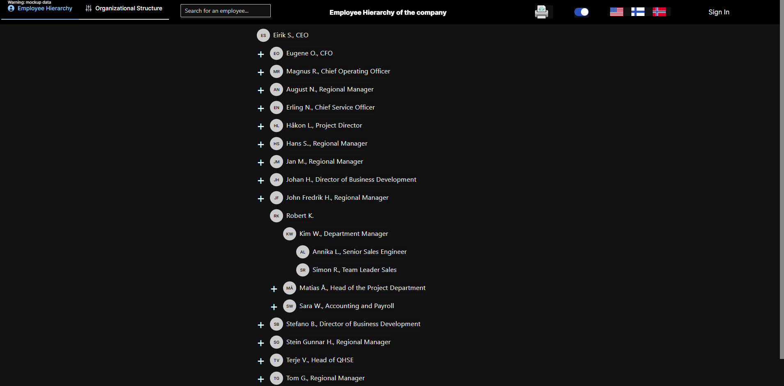
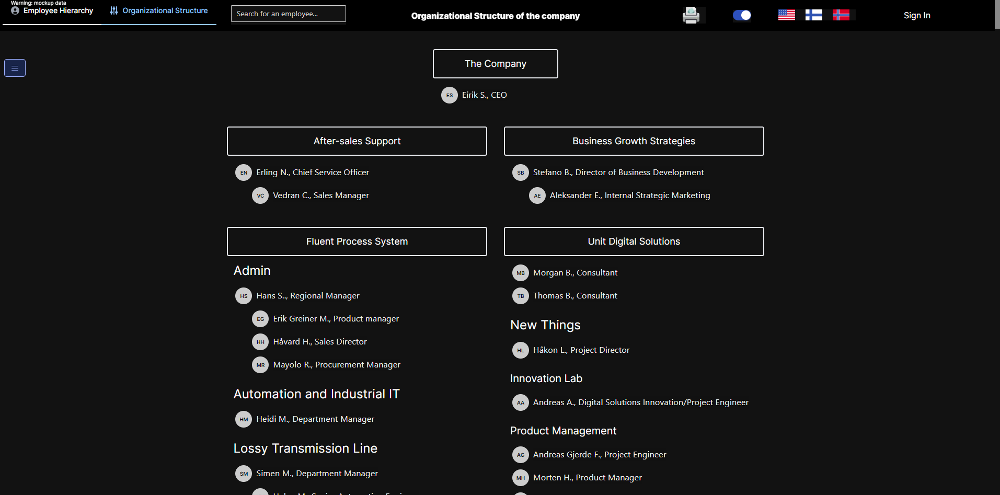
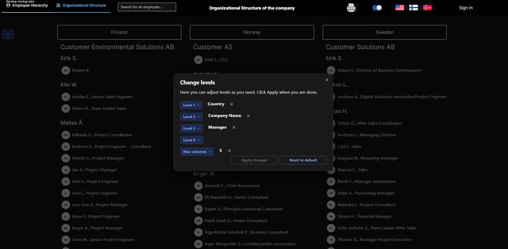
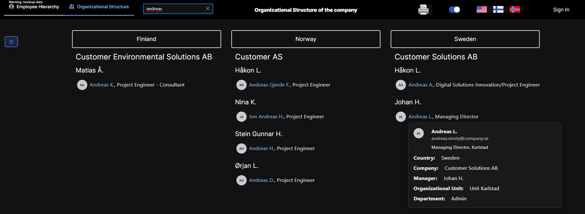
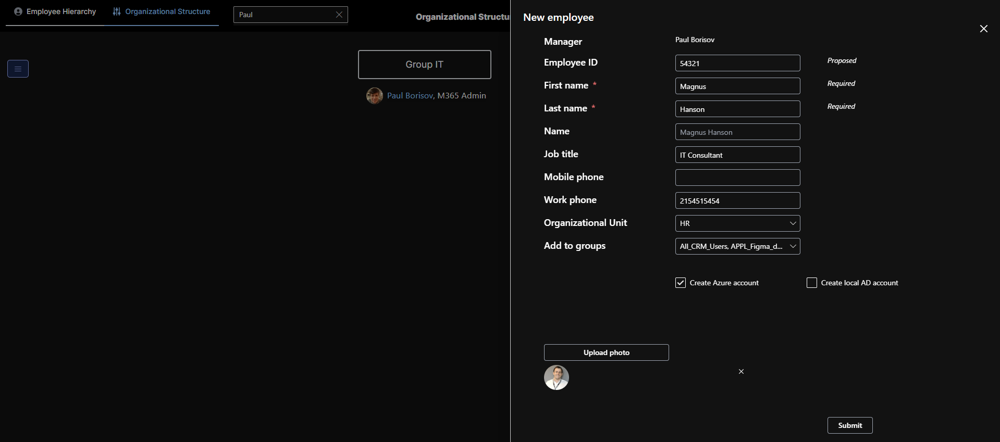
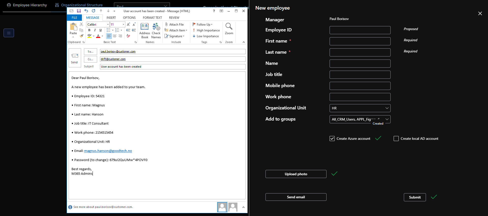
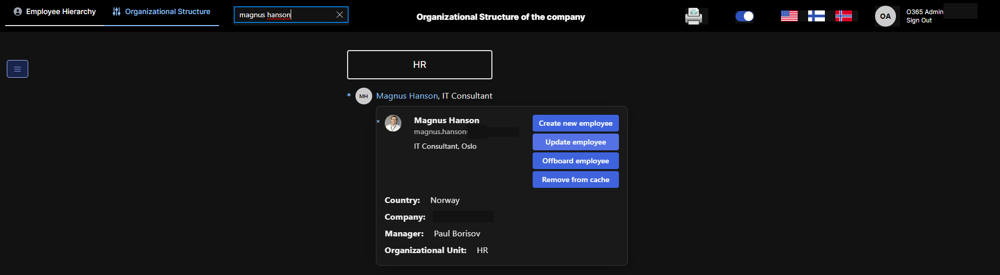
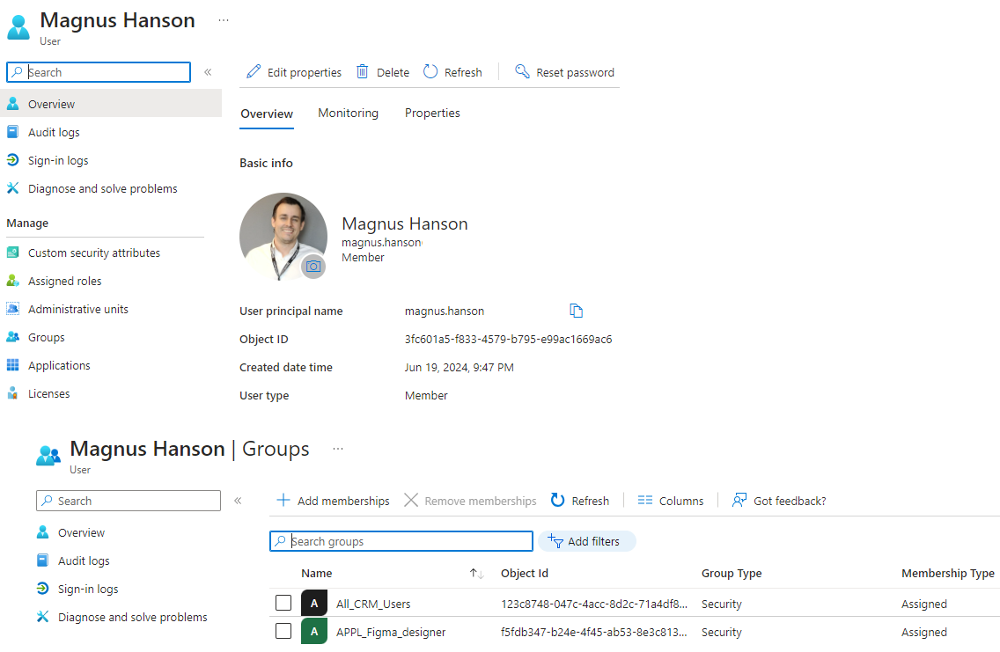
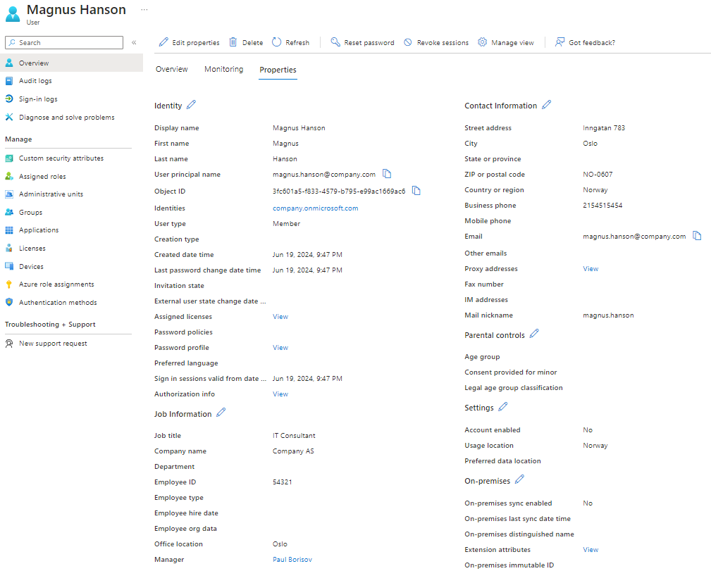
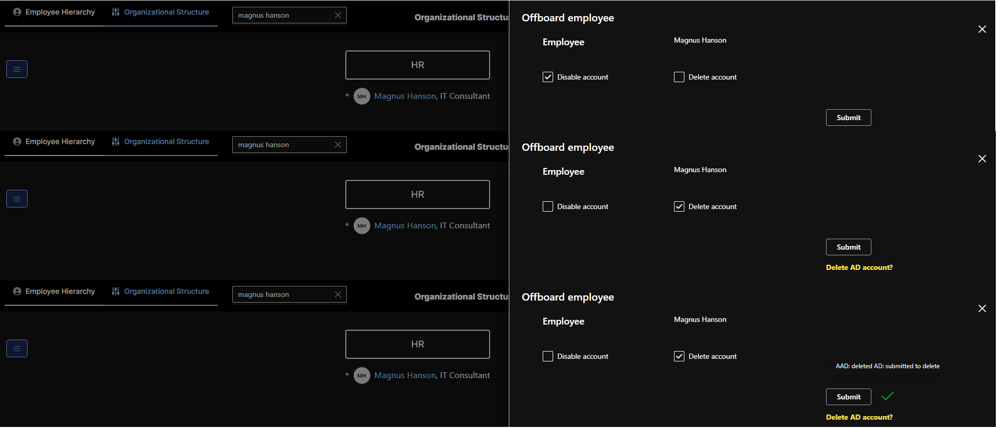

# HR onboarding and offboarding web app for Azure AD and local AD with flexible Organizational Charts

This is an HR onboarding and offboarding web app for managing employees in Azure AD and hybrid local AD.

- The app provides convenient options to create, update, and delete Entra ID and hybrid local AD accounts without a need to open VPN
  - In order to provide optional operations on local AD, the app uses standard capabilities of Azure Automation Hybrid Worker.
- The app also offers configurable Organizational Charts that provide displaying company hierarchies based on users attributes of Azure AD.
- Organizational Charts support flexible grouping by multiple user attributes up to 5 levels deep and up to 5 horizontal columns.

## Technical stack

### Backend

- Next.js 14.2.4
- Auth.js v5, OAuth2 / JWT
- Entra ID with MS Graph REST API, delegated API permissions
- Prisma with SLQLITE (default for quick start) / Azure SQL / Postgres providers
- Optional Azure Automation with Hybrid Worker to handle operations on local AD users
- Seamlessly deployable on Azure App Service. Recommended App Plan is Linux, 4Gb.

### Frontend

- React Hook Forms, Zod
- Tanstack Query
- i18n Next with support of EN, FI, NO locales
- Next Themes
- UI kits: Radix UI, Fluent UI, Tailwind CSS

# Getting Started

Create Azure App registration using the sample script located in samples/1_create-app-registration.ps1

- Note that all permissions are "delegated" meaning the user must have corresponding rights to use them as declared.
- In Entra ID operations on user management are available only for users that belong to the roles of User Administrators or Global Administrators.
- Users with lower privilegies will only access Organizational Charts without controls to manage users.
- Overview of permissions:

  - offline_access: delegated permission required to support refresh tokens
  - User.ReadWrite.All: delegated permission to manage user's attributes.
  - Directory.Read.All: delegated permission to read groups and enumerate global roles like User Administrators or Global Administrators.
  - Group.ReadWrite.All: delegated permission to add members to groups.
  - Directory.AccessAsUser.All: delegated permission used for admin impersonations.
  - AllSites.Write: this SharePoint permission is not required in default configurations and can be removed.

Make sure you gave Admin consent to approve the permissions.

Optionally, you can enable operations on hybrid local AD.

- Create Azure Automation account. Deploy two Powershell runbooks located in src/azureAutomation/runbooks. Adjust headers if required.
- Create and connect Hybrid Worker to a Windows Server VM running in the local AD network.
- This VM must have standard Active Directory PowerShell Module installed to operate with AD.

Running in the development environment:

```bash
cd src
npm i
# Turbopack integration for Next 14.2.x
turbo dev
# or
npm run dev
```

Open [http://localhost:3000](http://localhost:3000) with your browser to see the result.

# Deploy on Azure App Service (recommended)

The app is intended to run on Azure App Service. Recommended configuration: Linux, 4 Gb, Premium Plan (memory vs. price, the most optimal choice).

- "standalone" mode added into next.config.mjs
- To set the startup-file:
- az webapp config set --resource-group "YOUR-RESOURCE-GROUP" --name "company-hr-onboarding" --startup-file "node server.js"
- An example: https://dev.to/paulriviera/deploy-nextjs-14-app-to-linux-azure-app-service-3d34

The configured command "npm run build" uses:

On Windows

next build && @powershell copy .next/static .next/standalone/.next/static -recurse -force && @powershell copy public .next/standalone/public -recurse -force

On Linux

next build && cp -r -f .next/static .next/standalone/.next/static && cp -r -f public .next/standalone/public

Run:

npm run build

Deploy:

The entire folder .next/standalone to Azure App Service using Azure Tools extension in VSCode

## Known issues

HTTP ERROR 431: cleanup previous authentication cookies from your browser's Application tab. It should resolve the issue.

HTTP ERROR DNS_PROBE_FINISHED_NXDOMAIN: if you run your web app in the cloud environment like Azure App Service,
you should add the environment variable AUTH_URL=https://<your-web-app> to enable Auth.js v5 correctly.

- The recent comment "...it is not strictly necessary anymore in most environments" does not seem to work for Azure App Service; it is still required there.

## Deploy on Vercel (optional)

Check out our [Next.js deployment documentation](https://nextjs.org/docs/deployment) for more details.

### Screenshots

Full plain hierarchy



Three levels tree-view grouped by units, departments, and teams



Dialog to change groupings



Filtered view grouped by Country, Company, and Manager "andreas" with user-card



Adding a new Azure AD user for a manager



User account created, sending an email to inform the manager



Options to manage this user



User data



More user data



Disable or delete user. Deleted user


