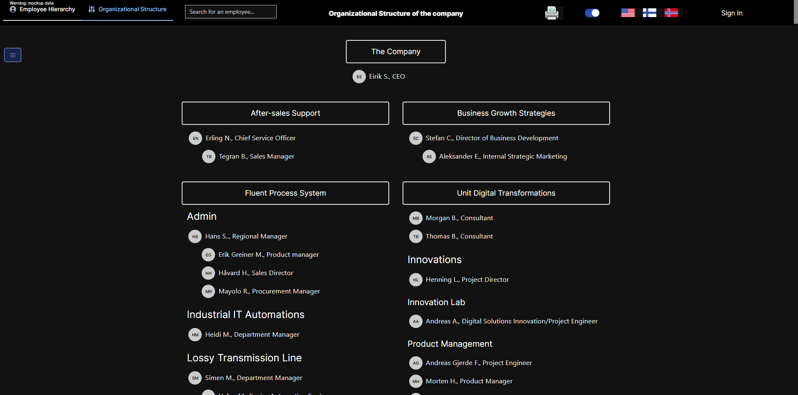
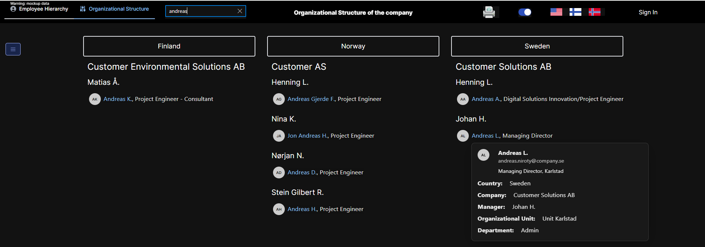
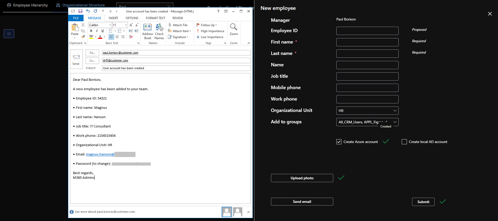
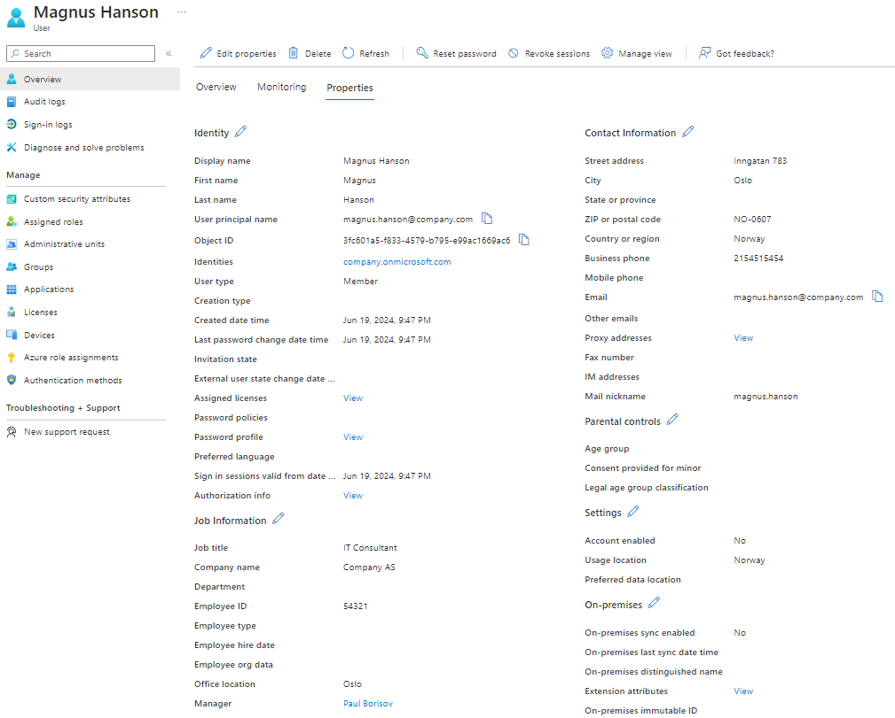

# HR onboarding and offboarding web app for Azure AD and local AD with flexible Organizational Charts

This is known that onboarding a new employee to company's working staff and offboarding of leaving members are continuous processes.
However, significant parts of these routines can be automated. For instance, the new employee typically joins specific manager's team.
This implies we can copy repeating parts of employee's attributes such as unit, department, country, subsidiary address and so on from the manager.
Also, there are standard routines such as generating new sign-in credentials, joining required security groups, sending a summary report to the manager.

This HR onboarding and offboarding web application solves most frequently problems related to managing employee accounts in Azure AD and hybrid local AD.

- It provides secure convenient options to quickly create, update, and delete Entra ID and hybrid local AD accounts without a need of opening a VPN connection.
- The app offers configurable Organizational Charts that provide displaying company hierarchies based on users attributes stored in Azure AD.
- Organizational Charts support flexible grouping by multiple user attributes up to 5 levels deep and up to 5 columns long.
- Optional operations on local AD are done using proxy-capabilities of Azure Automation Hybrid Worker connected to a VM with access to local AD.

## Technical stack

### Backend

- Next.js 14.2.4, turbo pack, React 18+.
- Auth.js v5 for App Router, OAuth2 / JWT. Default auth provider is Microsoft Entra ID.
- Entra ID with MS Graph REST API, delegated API permissions.
- Prisma ORM with SQLITE (default for quick start) / Azure SQL / Postgres providers.
  - Also tested with Drizzle ORM. However, it did not support Azure SQL, which I used to host my DB instance. I decided to keep Prisma.
- Server-side worker threads (Node.js worker_threads) to support loading optional user images in a non-blocking way.
  - I noticed that Server Actions have specific problems when they handle multiple simultaneous data fetching requests or database mutations.
    - For instance, this is possible to make bulk querying of users from Entra ID and save data to cache such as database "all at once".
    - However, there is no way to make bulk querying of multiple users' photos. These queries require a separate fetch request per each individual photo.
    - Cloud services such as Azure Apps limit the max number of simultaneous fetching requests. And, this may cause timeouts (https://github.com/nodejs/undici/issues/1531)
    - This may suspend new requests within the main thread causing undesired delays even though all requests are made in parallel async fetches.
    - Using server side worker_threads in Next.js solves this problem. It eliminates undesired delays in the main thread.
  - They should not be used for making intensive parallel mutations because they tend to block the main thread despite of async processing.
  - I found it possible to use worker threads in Next.js. They are poorly documented, but working well.
- Optional Azure Automation with Hybrid Worker to handle operations on local AD users.
- The app is seamlessly deployable on Azure App Service. Recommended App Plan is Linux, 4Gb (1.75GB is not enough).
  - Make sure you have restricted network access to your App Service for specific virtual networks and/or IP addresses.

### Frontend

- React Hook Forms, Zod
- Tanstack Query
- next-i18n-router with support of EN, FI, NO locales
- Next Themes, Dark and Light themes for all components
- UI kits: Radix UI, Fluent UI, Tailwind CSS
- PDF printing with no external modules

### Versions

Version 1.1

- Added three alternative ways to display user photos cached in the database:
  - Default: Redux Store + Query. It uses RTK hooks + a sync slice to save to store.
  - Redux Store with async thunk, the stardard way.
  - Previous logic with sessionStorage (the best performance in tests).
- Added With... HOCS.
- Optimized user photo rendering performance.
- July 3: fixed quirks in UI: nav blinks, Radix UI body shifts.

### Restricted access

In the safest scenario, you should deploy this Next.js web app either locally or on a server located within LAN.

- This way provides more enhanced protection against an unauthorized access.
- Users must be authenticated via the standard Microsoft login in order to get access to data acquired from Entra ID.

Alternatively, this application can be deployed as a Cloud service hosted in Azure, Vercel, or AWS.

- In this case, make sure you have restricted network access to the web app to specific IP segments.
- This is highly not recommended to leave your cloud app exposed to the entire Internet.

## Supported features

1. Full-size <a href="samples/images/1_full-plain-hierarchy.png">hierarchical</a> and <a href="samples/images/2_three-levels-tree-view-grouped-by-units-departments-teams.png">Organizational</a> Charts with configurable levels.

- They provide visual presentation of company's hierarchy based on selected attributes such as units, departments, teams, and manager-subordinate relations.
- In order to generate Org Chart hierarchies using Entra ID data, the user has to be authenticated via the standard login URL of Microsoft 365.
  - While the user is not authenticated, mockup data is shown by default. This can be turned off in .env settings.
- Hierarchies are <a href="samples/images/3_dialog-to-change-groupings.png">configurable</a> and printable.
- The views support full and partial <a href="samples/images/4_filtered-view-grouped-by-country-company-manager-andreas-user-card.png">search</a> by user's name.

2. Creating a new user account in Entra ID or hybrid local AD at any level of the hierarchy under the supervision of a specific manager.

- <a href="samples/images/5_adding-a-new-azure-ad-user-for-manager.png">This option</a> is available only for users that belong to global Entra ID roles of User Administrator or Global Administrator. Security checks are done automatically and regular users cannot see and access this feature.
- Required fields are minimal and include only First and Last name. The most of other attributes are optional or can be copied from the selected manager.
- The creator can choose:
  - Account type being created - cloud-only (Entra ID only) or hybrid local AD with sync via AD Connect
  - Desired security groups to add the new user to. Default groups are taken from env-variables, more can be selected in UI.
  - User photo for the new account.
  - Sending a <a href="samples/images/6_user-account-created-send-mail-to-inform-manager.png" data-interception="off">summary email</a> to the manager after successfully creating the user.

3. Two-stage offboarding for the leaving employee.

- <a href="samples/images/10_disable-delete-deleted-user.png">Stage 1</a> disables the existing employee in Azure AD or hybrid local AD, resets password, and removes group memberships. This stage is optional.
- Stage 2 removes employee's account from Azure AD or hybrid local AD.

4. <a href="samples/images/7_options-to-manage-this-user.png">Updating attributes</a> of existing users in Entra ID or hybrid local AD.

- This is an experimental feature, which currently supports changing EmployeeId. Mismatching EmployeeId was a frequent problem of my customer.

# Getting Started

Create Azure App registration using the sample script located in <a href="samples/1_create-app-registration.ps1">samples/1_create-app-registration.ps1</a>

- Ignore xml-files used to create for SharePoint Online lists. SharePoint options are not in use by default.
- Note that all permissions are "delegated" meaning the user must have corresponding rights to use them as declared.
- In Entra ID operations on user management are available only for users that belong to the roles of User Administrators or Global Administrators.
- Users with lower privilegies will only access Organizational Charts without controls to manage users.
- Overview of permissions:

  - offline_access: delegated permission required to support refresh tokens
  - User.ReadWrite.All: delegated permission to manage user's attributes.
  - Directory.Read.All: delegated permission to read groups and enumerate global roles like User Administrators or Global Administrators.
  - Group.ReadWrite.All: delegated permission to add members to groups.
  - Directory.AccessAsUser.All: delegated permission used for admin impersonations.
  - AllSites.Write: this SharePoint permission is not required in default configurations and can be removed.

Make sure you granted Admin consent to approve the permissions.

Optionally, you can enable operations on a hybrid local AD.

- Create Azure Automation account. Deploy two Powershell runbooks located in src/azureAutomation/runbooks. Adjust headers if required.
- Create and connect Hybrid Worker to a Windows Server VM running in the local AD network.
- This VM must have standard Active Directory PowerShell Module installed to operate with AD.

Running in the development environment:

- You should create .env using .env.example as a sample
- Update at least the following settings:
  - AZURE_AD_CLIENT_ID, AZURE_AD_CLIENT_SECRET (use the App registration created above), AZURE_AD_TENANT_ID
  - AZURE_AD_GRAPH_QUERY_USERS, review user attributes that you'd need
  - DATABASE_URL, it uses local SQLITE file by default
  - RENDER_USER_PHOTO_ON_CLIENT, RENDER_USER_PHOTO_ON_SERVER: keep them off to start faster
  - TREEVIEW_COLLAPSE_ON_ROOT: optionally change to false should you have quirks
  - USER_CARD_ATTRIBUTES: review user attributes that you'd need

```bash
cd src
# Then
npm i
# Generate Prisma client
npx prisma generate
# Start DEV mode with turbopack for Next 14.2.x
turbo dev
# Or, just start with npm
npm run dev
# In order to compile and run standalone Production version execute
npm run build
# Then remember to update .env and change to DATABASE_URL="file:../../../public/db/.sqlite"
# Then start your "local Production" server using
node .next/standalone/server.js
```

Open [http://localhost:3000](http://localhost:3000) with your browser to see the result.

# Deploy on Azure App Service

The app is intended to run on Azure App Service. Recommended configuration: Linux, 4 Gb, Premium Plan (memory vs. price, the most optimal choice).

- "standalone" mode added into next.config.mjs
- To set the startup-file:
- az webapp config set --resource-group "YOUR-RESOURCE-GROUP" --name "company-hr-onboarding" --startup-file "node standalone/server.js"
- An example: https://dev.to/paulriviera/deploy-nextjs-14-app-to-linux-azure-app-service-3d34

The configured command "npm run build" uses:

On Windows

next build && @powershell copy .next/static .next/standalone/.next/static -recurse -force && @powershell copy public .next/standalone/public -recurse -force

On Linux

next build && cp -r -f .next/static .next/standalone/.next/static && cp -r -f public .next/standalone/public

Run:

npm run build

Deploy the **entire root .next folder** to Azure App Service using Azure Tools extension for VSCode

- Remember to update App Service Environment settings (or .env file) and change to DATABASE_URL=file:/home/site/wwwroot/public/db/.sqlite

- Please also refer to the chapter [Restricted access](#restricted-access).

## Details

The command "npm run build" generates the root folder src/.next, and you should deploy the entire folder "as is".

- In general, this is enough to deploy only content of the subfolder src/.next/standalone under /home/site/wwwroot.
- However, App Service fails to to deploy only the standalone subfolder automatically.
  - It ends up with the error "Couldn't find any 'pages' or 'app' directory. Please create one under the project root"
- Deploying the entire parent folder resolves this issue. Just remember to update Configuration > Startup command to **node standalone/server.js**
  - You can change it in the settngs or using az webapp config set ... as mentioned above.
- <a href="samples/images/11_deployment_to-azure-app-service-using-azure-tools-vscode-extension.png">A screenshot</a>

## Known issues that may occur when you run the application

Too slow "Loading ..." phase and the "Warning: cache disabled" is visible above the left-hand navigation bar.

- The first access to the app with empty database can be slower and end up with the "Warning: cache disabled".
- After the first load and refilling DB cache, the app should reload pages in less than 1 second (< 0.5s with disabled photos).
- Otherwise, check the database connection string, it can be incorrect (see above).
- DB cache is refreshed automatically every hour in default configuration.

Sign-in error "Server error There is a problem with the server configuration. Check the server logs for more information."
- Make sure you have created [Azure App Registration](#getting-started), granted necessary permissions
- And added values of AZURE_AD_CLIENT_ID, AZURE_AD_CLIENT_SECRET, and AZURE_AD_TENANT_ID in Env-settings, for instance to .env-file

HTTP ERROR 431: cleanup previous authentication cookies from your browser's Application tab. It should resolve the issue.

HTTP ERROR DNS_PROBE_FINISHED_NXDOMAIN: if you run your web app in the cloud environment like Azure App Service,
you should add the environment variable AUTH_URL=https://<your-web-app> to enable Auth.js v5 correctly.

- The recent comment "...it is not strictly necessary anymore in most environments" does not seem to work for Azure App Service; it is still required there.

# Deploy on Vercel (optional)

Check out our [Next.js deployment documentation](https://nextjs.org/docs/deployment) for more details.

# Screenshots

Full plain hierarchy


Three levels tree-view grouped by units, departments, and teams



Dialog to change groupings


Filtered view grouped by Country, Company, and Manager "andreas" with user-card



Adding a new Azure AD user for a manager


User account created, sending an email to inform the manager



Options to manage this user


User data


More user data



Disable or delete user. Deleted user


